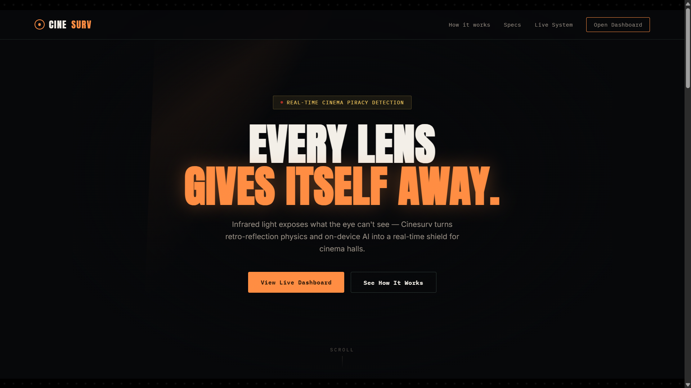
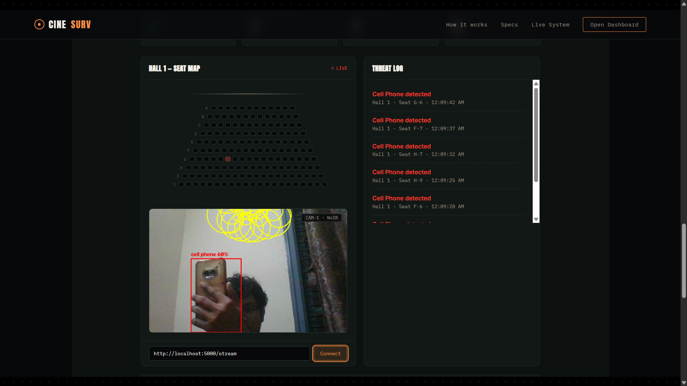

# Cinesurv — Real-Time Cinema Piracy Detection Using Edge AI

> A full-stack IoT security system that detects unauthorized recording devices in real time, using infrared retro-reflection physics on the edge and a Spring Boot backend for real-time alerting.

---

## Overview

Cinema piracy costs the film industry substantial losses every year, with films frequently leaked online within hours of theatrical release. Cinesurv addresses this with a **non-intrusive, autonomous detection system**: infrared LEDs illuminate a hall at a wavelength invisible to the human eye, a Raspberry Pi-based edge unit detects the characteristic retro-reflective glint of any camera lens in the room, a lightweight ML model verifies the object, and a **Spring Boot backend broadcasts the alert to a live dashboard in real time** — no polling, sub-second propagation.

This repository contains the **backend service, real-time dashboard, and edge-device detection pipeline**.

---

## Screenshots

### Landing Page


### Live Dashboard & Seat Mapping



---

## Architecture

```
  EDGE DEVICE (Raspberry Pi)
  ─────────────────────────────────────────────
    NoIR Camera
         │
         ▼
    Phase 1 · OpenCV Glint Detection        (runs on every frame — cheap)
         │
         │  triggers only on a glint candidate
         ▼
    Phase 2 · TFLite ML Classification      (runs only when triggered)
         │
         │  confirmed threat
         ▼
    HTTP POST  /api/alerts/log


  SPRING BOOT BACKEND
  ─────────────────────────────────────────────
    AlertController
         │
         ▼
    AlertService ──────────────┬──────────────────────┐
         │                     │                       │
         ▼                     ▼                       ▼
    AlertRepository      PostgreSQL / H2        SimpMessagingTemplate
       (JPA)                                            │
                                                          │  STOMP broadcast
                                                          ▼
                                              /topic/live-threats


  DASHBOARD (Browser)
  ─────────────────────────────────────────────
    WebSocket Subscriber  ───►  Live Seat Map + Real-Time Alert Feed
    REST calls (history / stats / resolve)  ◄──►  AlertController
```

**Why this design:** running ML inference on every video frame is too expensive for constrained edge hardware, so a cheap OpenCV heuristic (Hough Circle Transform on thresholded frames) gates the expensive TensorFlow Lite classification — inference only runs when there's genuinely something to verify. On the backend side, alerts are persisted via Spring Data JPA **and** pushed instantly over WebSocket, so the dashboard updates with zero polling latency.

---

## Backend Highlights (Spring Boot)

This is the part of the codebase most relevant if you're evaluating backend engineering ability:

- **Layered architecture** — clean separation between `controller` (HTTP concerns), `service` (business logic, WebSocket broadcasting), `repository` (Spring Data JPA), and `model` (JPA entities + DTOs)
- **REST API** — standard resource-oriented endpoints for alert ingestion, history, filtering, and lifecycle management (`ACTIVE` → `RESOLVED`)
- **Real-time push architecture** — Spring's WebSocket + STOMP support (`SimpMessagingTemplate`) broadcasts to subscribed clients the instant an alert is persisted, avoiding the latency and wasted requests of client-side polling
- **Dual-profile datasource configuration** — H2 in-memory for zero-setup local development, PostgreSQL profile for production, switched via Spring profiles (`--spring.profiles.active=postgres`)
- **CORS configuration** — explicit `WebMvcConfigurer` setup so the edge device (on a different host/network) and browser dashboard can call the API safely
- **`@PrePersist` lifecycle hooks** — automatic timestamping without polluting business logic
- **Aggregation queries** — custom repository methods (`countByStatus`, `countByDetectedAtBetween`) backing a `/stats` endpoint, demonstrating query derivation beyond basic CRUD

---

## API Reference

| Method | Endpoint | Description |
|---|---|---|
| `POST` | `/api/alerts/log` | Ingest a new detection from an edge device |
| `GET` | `/api/alerts/history` | All alerts, most recent first |
| `GET` | `/api/alerts/active` | Currently unresolved alerts only |
| `GET` | `/api/alerts/stats` | Aggregate counts (active, resolved, today, total) |
| `PUT` | `/api/alerts/{id}/resolve` | Mark an alert as resolved |
| `DELETE` | `/api/alerts/{id}` | Remove an alert record |
| `WS` | `/ws` (STOMP) | Subscribe to `/topic/live-threats` for real-time push |

---

## Tech Stack

| Layer | Technology |
|---|---|
| Backend | Java 17, Spring Boot 3.2, Spring Web, Spring Data JPA, Spring WebSocket |
| Database | PostgreSQL (production), H2 (development) |
| Edge AI | Python, OpenCV, TensorFlow Lite (SSD-MobileNetV1, quantized, COCO-pretrained) |
| Edge Hardware | Raspberry Pi 3B+, Pi NoIR Camera V2, 940nm IR LED array |
| Frontend | Vanilla JS, WebSocket/STOMP client, Three.js, GSAP |
| Real-time transport | WebSocket over SockJS with STOMP messaging |

---

## Project Structure

```
cinesurv-backend/
├── src/main/java/com/cinesurv/backend/
│   ├── controller/       # REST endpoints
│   ├── service/          # Business logic + WebSocket broadcasting
│   ├── repository/       # Spring Data JPA interfaces
│   ├── model/            # JPA entities + response DTOs
│   └── config/           # WebSocket + CORS configuration
├── src/main/resources/
│   ├── application.properties            # H2 (default, dev)
│   ├── application-postgres.properties   # PostgreSQL (production)
│   └── static/                           # Dashboard frontend
├── edge-device/
│   ├── cinesurv_two_phase.py    # Two-phase detection pipeline (glint trigger + ML)
│   ├── cinesurv_edge_detector.py
│   └── glint_detector.py        # Standalone Phase 1 diagnostic tool
└── simulator/
    └── simulate_pi_alerts.py    # Backend testing without hardware
```

---

## Getting Started

### Backend
```bash
cd cinesurv-backend
mvn spring-boot:run
```
Runs on `http://localhost:8080` with an in-memory H2 database by default. For PostgreSQL:
```bash
mvn spring-boot:run -Dspring-boot.run.profiles=postgres
```

### Dashboard
Visit `http://localhost:8080/` — served automatically from Spring Boot's static resources.

### Edge Device (Raspberry Pi)
```bash
python3 cinesurv_two_phase.py \
  --source picam \
  --model model/detect.tflite \
  --labels model/labelmap.txt \
  --backend http://<backend-ip>:8080/api/alerts/log
```

### No hardware available?
```bash
python simulator/simulate_pi_alerts.py
```
Sends realistic mock detections in the exact payload shape the real edge device uses — useful for backend/frontend development without a Pi on hand.

---

## Roadmap

- [ ] Spring Security + API key authentication for edge device requests
- [ ] Calibrated per-hall seat mapping (homography transform) instead of proportional grid estimation
- [ ] Multi-hall / multi-camera aggregation dashboard
- [ ] SMS/Telegram notification integration
- [ ] Docker Compose for one-command backend + PostgreSQL setup

---

## Team

Built as a Phase I mini-project — Department of Electronics and Communication Engineering, RNS Institute of Technology (VTU).

**Guide:** Prof. Ghousia Begum S

---

## License

MIT
